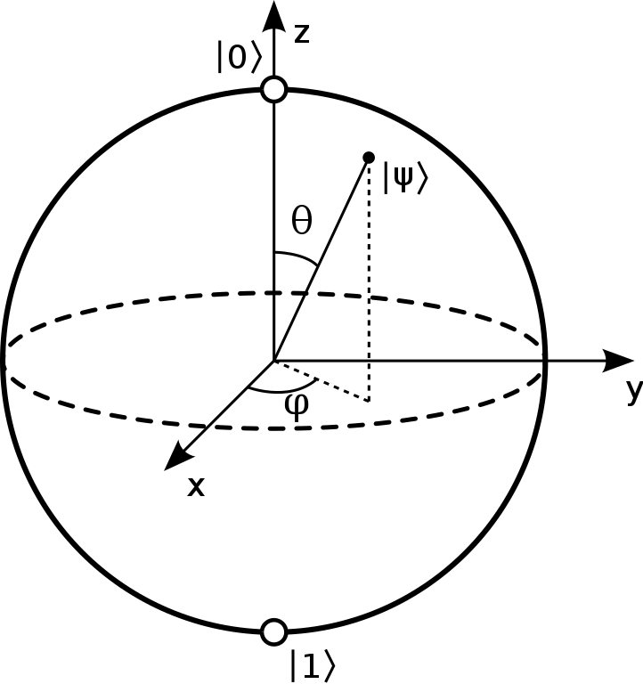

<!-- Copyright 2023 Kieran W Harvie. All rights reserved. -->

**:warning:Living Document: All Parts are Subject to Change:warning:**

This repo is a demonstration of my understanding of quantum computation, and [Qiskit](https://qiskit.org/) in particular.
The long term plan for this repo is:
1. Some Quantum Physics Revision
2. Implementation of Important Quantum Algorithms
3. Run some of the algorithms on an actual quantum computer
	- Learn some technique for dealing with real-world conditions
4. Learn Some Advanced features
	- For example Pulses and other time features.

	
	 
	    A drawing of the Block Sphere by Smite-Meister.
	 

