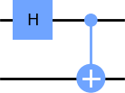
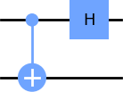
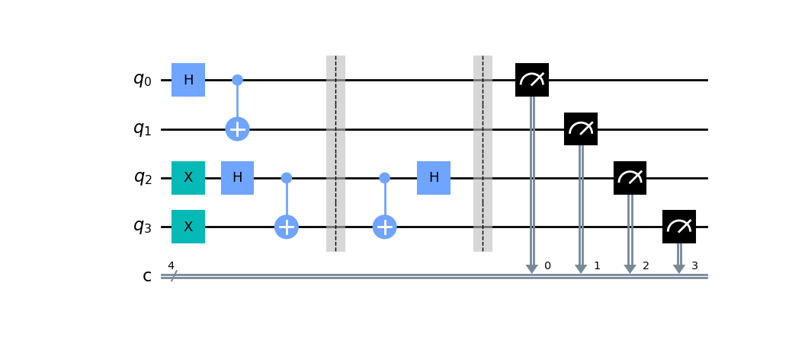

<!-- Copyright 2023 Kieran W Harvie. All rights reserved. -->

# Bell Creation and Measurement
The creation and measurement of Bell states is the hello world of quantum computing.
<p align="center">
	
	&nbsp;&nbsp;&nbsp;&nbsp;
	
	<br/>
	Diagrams representing the creation (left) and measurement (right) of Bell states.
</p>
The easiest way to show this is with matrix form of the gates.
A Hadamard gate on the top qubit and nothing on the bottom has the matrix:

```math
H \otimes I = \frac{1}{\sqrt{2}}\begin{bmatrix}1&1\\1&-1\end{bmatrix} \otimes
\begin{bmatrix}1&0\\0&1\end{bmatrix} = \frac{1}{\sqrt{2}} 
\begin{bmatrix}1&0&1&0\\0&1&0&1\\1&0&-1&0\\0&1&0&-1\\\end{bmatrix}
```
And the $CNOT$ matrix can be read from the book:

```math
CNOT =\begin{bmatrix}1&0&0&0\\
0&1&0&0\\
0&0&0&1\\
0&0&1&0 \end{bmatrix}
```
Multiplication gives:

```math
CNOT(H\otimes I) = \frac{1}{\sqrt{2}}
\begin{bmatrix} 1&0&1&0\\ 0&1&0&1\\ 0&1&0&-1\\ 1&0&-1&0\end{bmatrix}
```
The columns of this matrix are the Bell states, hence:

```math
CNOT(H\otimes I) = |\Phi^+\rangle\langle 00 | + |\Psi^+\rangle\langle 01| + |\Phi^-\rangle\langle 10| + |\Psi^-\rangle\langle 11 |
```
Hence we can create any of Bell states by selecting the appropriate initial state,
for example $CNOT(H\otimes I)|00\rangle = |\Phi^+\rangle$

We can reuse this result for measuring Bell states by noticing that all the results are involutory:
```math
H^2=CNOT^2=I^2=I
```
Hence the inverse of this outer product is:
```math
(H\otimes I)CNOT = |00\rangle\langle \Phi^+| + |01\rangle\langle \Psi^+| + |10\rangle\langle \Phi^-| + |11\rangle\langle \Psi^-|
```
Meaning we can measure which state we are in by reversing the circuit:
```math
(H\otimes I)CNOT|\Phi^-\rangle = |10\rangle
```

# Simulation
<p align="center">
	
	<br/>
	The ciruit to be simulated.
</p>
The Qiskit code for simulating this circuit is located in bell_state.py.
I've used barriers to split the circuit into three seditions, both for visual clarity and to stop the qiskit complier combining creators and measurers.
In the first section we create two Bell states.
In Qiskit all quibits start in $|0\rangle$ but for variety invert the 2nd and 3rd qubits.
In the second section I but the 2nd and 3rd qubits into a Bell measurer. 
In the final section I measure the quantum states and but the results in the classical registers.

After simulation the results are:
| State | Count |
| --- | --- |
| $\|1111\rangle$ | 493 |
| $\|1100\rangle$ | 531 |

The two most significant bits are always ``11`` because the $|\Psi^-\rangle$ state is created on the 2nd and 3rd qubits, which is measured as $|11\rangle$.
The two least significant bis are equally ``11`` and ``00`` because it is in the $|\Phi^+\rangle$ Bell state.
