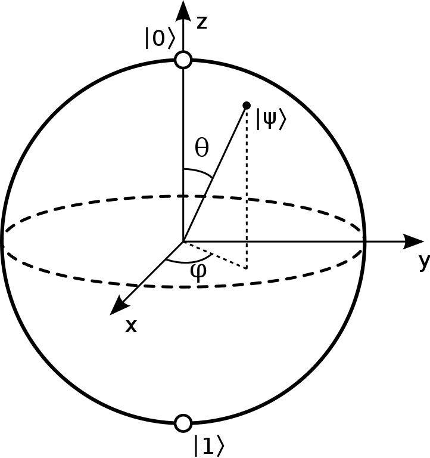

<!-- Copyright 2023 Kieran W Harvie. All rights reserved. -->

# Quantum Physics 101
## Qubits and the Bloch Sphere
A qubit is a two-state quantum system.
The pure states of a qubit, 
ones in without uncertainty of quantum state,
can be graphically represented by the Bloch sphere:

	
	 
	    A drawing of the Block Sphere by Smite-Meister.
	 

The base states, $|0\rangle$ and $|1\rangle$, are the poles of the sphere.
Polar angle is relative amount of these bases states and azimuthal angle is relative phase.
(Remember that only relative phase matters,
so unless there are two qubits azimuthal angle doesn't matter.)

We represent the state as a column vector such that:
\[a|0\rangle + b|1\rangle \rightarrow \begin{bmatrix} a \\ b \end{bmatrix}\]
Inner products are row vectors:
\[a\langle 0| + b\langle 1| \rightarrow \begin{bmatrix} a & b \end{bmatrix}\]
And outer products as matrices:
\[a_{00}|0\rangle\langle 0|+a_{01}|0\rangle\langle 1|+a_{10}|1\rangle\langle 0|+a_{11}|1\rangle\langle 1| \rightarrow \begin{bmatrix} a_{00}&a_{01}\\a_{10}&a_{11}\end{bmatrix}\]

## Pauli 
Half cycle rotations around the x,y, and z axes of the Bloch sphere are given by:
\[X = \begin{bmatrix} 0&1\\1&0\end{bmatrix},\quad Y = \begin{bmatrix} 0&-i\\i&0\end{bmatrix},\quad Z = \begin{bmatrix} 1&0\\0&-1\end{bmatrix}\]
These will be used as common and useful quantum gates later and the reader should become familiar with them.

It's worth noting that when operating on the basis states the $X$ Pauli matrix is the same as the negation,
 that is:
\[|0\rangle \mapsto |1\rangle,\quad |1\rangle \mapsto |0\rangle\]

These matrices, combined with the identity matrix $I$, when multiplied by the complex units constitute the Pauli group:
\[\mathcal{P}_1 = \{\pm I,\pm iI,\pm X, \pm iX,\pm Y, \pm iY,\pm Z,\pm iZ\}\] 
Curiously, this group includes the quaternions group as a normal subgroup:
\[\{\pm I, \pm iX, \pm iY,\pm iZ\}\] 

## Subsystems and the Tensor Product
A quantum systems consisting of two qubits is just the tensor product $\otimes$ of two qubit states.
We denotes the basis of the combined systems as ordered list of $1$s and $0$s.
For example $|11\rangle = |1\rangle\otimes|1\rangle$ is when both quibits in the $|1\rangle$ state.
The conversion between kets and column vectors work as expected:
\[a|00\rangle + b|01\rangle + c|10\rangle + d|11\rangle \rightarrow \begin{bmatrix} a \\ b\\c\\d \end{bmatrix}\]
Matricies are more involved, but if you rememver that the dual-baiss works similarly to the regular basis ($\langle 11| = \langle 1|\otimes \langle 1|$ ) then you can verify that:
\[\begin{bmatrix} a_{00}&a_{01}\\a_{10}&a_{11}\end{bmatrix}\otimes\begin{bmatrix} b_{00}&b_{01}\\b_{10}&b_{11}\end{bmatrix} = 
\begin{bmatrix}
a_{00}b_{00}&a_{00}b_{01}&a_{01}b_{00}&a_{01}b_{01} \\
a_{00}b_{10}&a_{00}b_{11}&a_{01}b_{10}&a_{01}b_{11} \\
a_{10}b_{00}&a_{10}b_{01}&a_{11}b_{00}&a_{11}b_{01} \\
a_{10}b_{10}&a_{10}b_{11}&a_{11}b_{10}&a_{11}b_{11} \\
\end{bmatrix}\]
The process can be simplified by observing that the top-left quadrant is $a_{00}\begin{bmatrix} b_{00}&b_{01}\\b_{10}&b_{11}\end{bmatrix}$ and likewise for other quadrants.

## Named States
Before continuing to common logic gates, there are two more useful named class of states.
The states defined by:
\[|+\rangle = \frac{1}{\sqrt{2}}(0\rangle + |1\rangle),\quad |-\rangle = \frac{1}{\sqrt{2}}(0\rangle - |1\rangle)\]
Are called the "polar base", compared to the standard $|0\rangle,\,|1\rangle$ "computational base", and can be thought of as a half rotation of the computational base around the angular bisector of the x and z axes.

Bell's states, also called EPR pairs, are states of two quibits that represent the simplest examples of quantum entanglement.
They are given by:
\[|\Psi^\pm\rangle = \frac{1}{\sqrt{2}}(|01\rangle\pm|10\rangle),\quad|\Phi^\pm\rangle = \frac{1}{\sqrt{2}}(|00\rangle\pm|11\rangle)\]
Note that these four linearly independent states form a basis called the Bell basis.

# Common Logic Gates

## 
Measurement

# Important Results
There are some important results that effect quantum computation.
Don't worry about the details too much in the beginning,
just keep them back of mind.

## No-Cloning Theorem
The no-cloning theorem states that is it impossible to create and independent and identical copy of an arbitrary unknown quantum state.
This means that we can't create a Logic Gate which inputs an arbitrary quantum state and outputs two copies.

It is possible to circumvent this theorem by not state not be both arbitrary and independent  having the arbitrary state be independent. 
In particular the theorem does allow a system to get entangled with another,
as we will see in the quantum teleportation protocol.

## Deferred Measurement Principle
The deferred measurement principle states that we can delay measurements till the end of quantum computation without effecting the outcome distribution.
This gives us the flexibility to move measurements around as is best for  convenience or performance.

## Gottesman-Knill Theorem
There is a group of quantum gates called the Clifford Group that includes common gates like Hadamard, $CNOT$, and $SWAP$.
The Gottesman-Knill theorem states that quantum computation involving just gates from the Clifford Group can efficiently be perfectly simulated (polynomial time).
For us this means two things:
1. Any competitive spot for quantum computation in the wider computing landscape will require algorithms that necessarily use gates outside the Clifford group.
2. While learning quantum computation it is likely that we can efficiently use classical computer, guarantied if we only use Clifford group gates.
