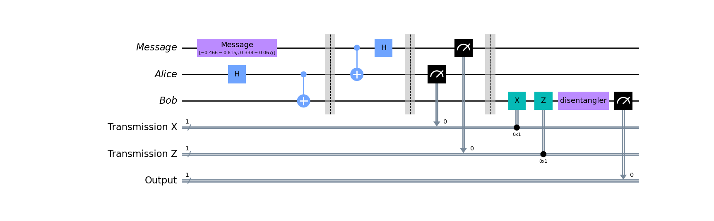
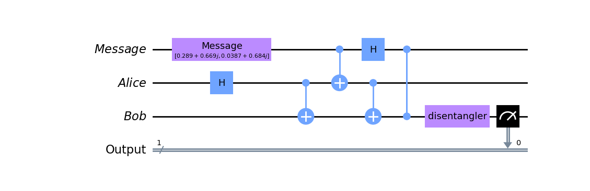

<!-- Copyright 2023 Kieran W Harvie. All rights reserved. -->

# Quantum Teleportation
As revised in the revision directory there is no way to clone an independent, arbitrary, unknown state.
But work has continued in the area of communicating quantum states by compromising on one of the conditions.

Quantum Teleportation is foremost result which clones an arbitrary and unknown state between two parties at the cost of changing the original by entangling it with a shared bell state.

The most enlightening form of the algorithm transports the information between parties in a classical channel.
But for practical reasons a method with deferred measurement also exits and will be presented.

# Classical Transmission
<p align="center">
	
	<br>
		A circuit diagram for quantum teleportation with classical transmission.
	<br>
</p>
We will trace this algorithm by checking the state of the registers at each barrier.
Examples on writing the matrices in full can found in the bell directory.

Let the message state be given by:
```math
|\text{Message}\rangle = m_0|0\rangle+m_1|1\rangle
```
Then the state at the first barrier is:
```math
|\text{Message}\rangle\otimes|\Phi^+\rangle = \frac{1}{\sqrt{2}}\bigg(m_0|000\rangle+m_0|011\rangle+m_1|100\rangle + m_1|111\rangle\bigg)
```
Observe that message and bell state are separable,
now check the second barrier: 
```math
\frac{m_0}{2}\bigg(|000\rangle+|100\rangle+|011\rangle+|111\rangle\bigg)+\frac{m_1}{2}\bigg(|010\rangle-|110\rangle+|001\rangle-|101\rangle\bigg)
```
The message and bell state are now entangled and the state looks messy but can be written as a sum over the first two labels as:
```math
\frac{|00\rangle}{2}\otimes(m_0|0\rangle+m_1|1\rangle)+
\frac{|01\rangle}{2}\otimes(m_1|0\rangle+m_0|1\rangle)+
\frac{|10\rangle}{2}\otimes(m_0|0\rangle-m_1|1\rangle)+
\frac{|11\rangle}{2}\otimes(-m_1|0\rangle+m_0|1\rangle)
```

This seperatbility lets us know what Bob's state will be after measuring the X and Z bits:
| Z bit | X bit | Bob's State |
| --- | --- | --- |
| 0 | 0 | $m_0\|0\rangle+m_1\|1\rangle|$
| 0 | 1 | $m_1\|0\rangle+m_0\|1\rangle|$
| 1 | 0 | $m_0\|0\rangle-m_1\|1\rangle|$
| 1 | 1 | $-m_1\|0\rangle+m_0\|1\rangle|$

The goal is to get back to $m_0|0\rangle+m_1|1\rangle$.
First notice that every state with the coefficients switch has a X bit set, and vise-versa.
After swapping the coefficients we notice that every state with a Z bit set has a negative $|1\rangle$ and vise-versa.
These operations correspond to the X and Z gates,
as implied by the bit names,
and after completing these operations Bob's state has returned to the message state.

The final gate isn't part of the teleportation and is the initiating gate's disentangler.
If the initial state is present then the disentangler outputs $|0\rangle$,
basically it makes measurement easier.

With everything set up we can simulate the circuit,
giving the following results:
| State | Count |
| --- | --- |
| 010 | 254 |
| 000 | 262 |
| 011 | 256 |
| 001 | 252 |

This isn't the expected results.
What's happening is that measuring and then preforming other quantum operations is very buggy.
This isn't a problem with the simulation,
or more accurately it's a problem with quantum computers that is correctly being simulated.

So what should be done?
While it is possible to tweak the simulator setting to avoid this behaviour now this is also a good opportunity to practice deferred measurement.

# Deferred Measurement
<p align="center">
	
	<br>
		A circuit diagram for quantum teleportation with deferred measurement.
	<br>
</p>

Despite not as demonstrative as moving the Z and X bits classically,
since the goal of teleportation is to communicate information about the quantum state over some distance and not just within the same quantum computer,
we can preform $CZ$ and $CX$ as quantum operations and then measure.
Doing so gave the above circuit.

Although not as practically useful it does work as a proof of concept as it outputs $0$ all 1024 times.
